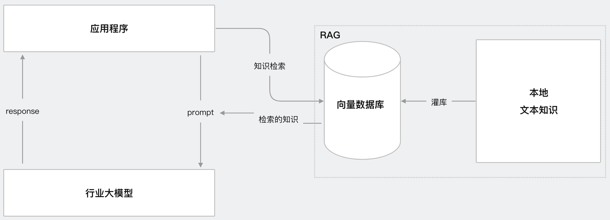
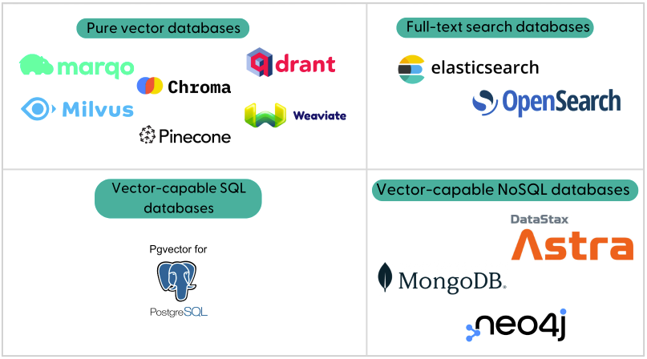
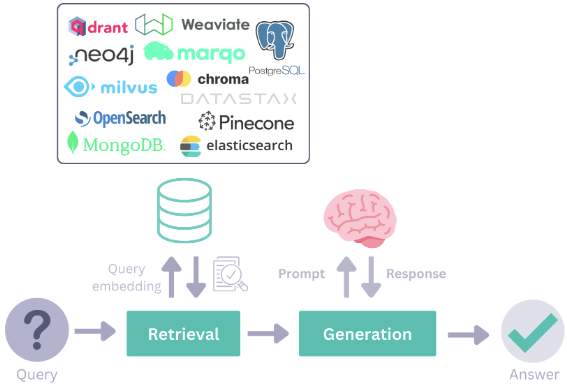

# 1、介绍
## 1.1 主要内容                      
使用Haystack开源框架实现RAG(Retrieval Augmented Generation 检索增强生成)应用，核心思想:人找知识，会查资料；LLM找知识，会查向量数据库             
使用LangChain开源框架实现RAG应用项目地址:https://github.com/NanGePlus/RagLangChainTest                                       
本次应用案例实现功能为:                            
**(1)离线步骤(构建索引):** 文档加载->文档切分->向量化->灌入向量数据库                                    
**(2)在线步骤(检索增强生成):** 获取用户问题->用户问题向量化->检索向量数据库->将检索结果和用户问题填入prompt模版->用最终的prompt调用LLM->由LLM生成回复                            
                              
相关视频:                   
https://www.bilibili.com/video/BV1nXkxYQEVp/                   
https://youtu.be/sI_vxzGeOUY                  

## 1.2 Haystack框架
Haystack是一个开源框架，它由deepset开发，用于构建强大的QA问答、检索增强生成RAG等AI应用，支持构建从小型本地化应用到大规模生产级应用多种场景                                                                                                                     
官方网址：https://haystack.deepset.ai/                                                       
Github地址:https://github.com/deepset-ai/haystack                            
**核心概念介绍:**                                        
**DocumentStore 文档存储:** 文档存储库是一个数据库，它存储你的数据，并在查询时将数据提供给检索器(Retriever)                      
                  
**Components 组件:** 是构成pipeline的重要组成部分，组件负责处理相关的业务逻辑                                         
**Pipelines 流水线:** 将不同的功能组件进行逻辑编排，形成一个有向无环图，最后运行pipeline                                    
                     

# 2、前期准备工作
## 2.1 开发环境搭建:anaconda、pycharm
anaconda:提供python虚拟环境，官网下载对应系统版本的安装包安装即可                                      
pycharm:提供集成开发环境，官网下载社区版本安装包安装即可                                               
**可参考如下视频:**                      
集成开发环境搭建Anaconda+PyCharm                                                          
https://www.bilibili.com/video/BV1q9HxeEEtT/?vd_source=30acb5331e4f5739ebbad50f7cc6b949                             
https://youtu.be/myVgyitFzrA          

## 2.2 大模型相关配置
(1)GPT大模型使用方案(第三方代理方式)                               
(2)非GPT大模型(阿里通义千问、讯飞星火、智谱等大模型)使用方案(OneAPI方式)                         
(3)本地开源大模型使用方案(Ollama方式)                                             
**可参考如下视频:**                                   
提供一种LLM集成解决方案，一份代码支持快速同时支持gpt大模型、国产大模型(通义千问、文心一言、百度千帆、讯飞星火等)、本地开源大模型(Ollama)                       
https://www.bilibili.com/video/BV12PCmYZEDt/?vd_source=30acb5331e4f5739ebbad50f7cc6b949                 
https://youtu.be/CgZsdK43tcY           

# 3、项目初始化
## 3.1 下载源码
GitHub或Gitee中下载工程文件到本地，下载地址如下：                
https://github.com/NanGePlus/HaystackTest                                                               
https://gitee.com/NanGePlus/HaystackTest                                     

## 3.2 构建项目
使用pycharm构建一个项目，为项目配置虚拟python环境                       
项目名称：HaystackTest                          
虚拟环境名称保持与项目名称一致                           

## 3.3 将相关代码拷贝到项目工程中           
将下载的代码文件夹中的文件全部拷贝到新建的项目根目录下                             

## 3.4 安装项目依赖                            
新建命令行终端，在终端中运行 pip install -r requirements.txt 安装依赖                                                      
**注意:** 建议先使用要求的对应版本进行本项目测试，避免因版本升级造成的代码不兼容。测试通过后，可进行升级测试                                                                           

# 4、功能测试 
### (1)测试文档准备                                                          
这里以pdf文件为例，在input文件夹下准备了两份pdf文件                
健康档案.pdf:测试中文pdf文档处理                 
llama2.pdf:测试英文pdf文档处理                   
### (2)大模型准备                                    
**gpt大模型(使用代理方案):**                           
OPENAI_BASE_URL=https://yunwu.ai/v1                            
OPENAI_API_KEY=sk-5tKSZtEo4WsXKZJE8v4JeFqV8eNf6GwYwJFgT5JFJ42DP7qe                                
OPENAI_CHAT_MODEL=gpt-4o-mini                                  
OPENAI_EMBEDDING_MODEL=text-embedding-3-small                             
**非gpt大模型(使用OneAPI方案):**                                  
OPENAI_BASE_URL=http://139.224.72.218:3000/v1                             
OPENAI_API_KEY=sk-VIm8DGiCtF5Dc46pEd393967Bf554e7a8dA5A8AeFfDcCd75                                      
OPENAI_CHAT_MODEL=qwen-plus                                      
OPENAI_EMBEDDING_MODEL=text-embedding-v1                        
### (3)离线步骤(构建索引)                        
文档加载->文档切分->向量化->灌入向量数据库                                                    
在根目录下的ragTest/tools文件夹下提供了pdfSplitTest_Ch.py脚本工具用来处理中文文档、pdfSplitTest_En.py脚本工具用来处理英文文档                                                                    
在根目录下的ragTest/vectorSaveTest.py脚本执行调用tools中的工具进行文档预处理后进行向量计算及灌库(Chroma向量数据库)                                                                                                         
打开命令行终端，进入脚本所在目录，运行 python vectorSaveTest.py 命令                                                                                          
### (4-1)在线步骤(检索增强生成),测试demo
获取用户问题->用户问题向量化->检索向量数据库->将检索结果和用户问题填入prompt模版->用最终的prompt调用LLM->由LLM生成回复                                     
在根目录下的ragTest/queryTest.py脚本实现核心业务逻辑                                                                       
打开命令行终端，进入脚本所在目录，运行 python queryTest.py 命令                                
### (4-2)在线步骤(检索增强生成),封装为API接口对外提供服务           
获取用户问题->用户问题向量化->检索向量数据库->将检索结果和用户问题填入prompt模版->用最终的prompt调用LLM->由LLM生成回复                                
在根目录下的ragTest/main.py脚本实现核心业务逻辑并封装为API接口对外提供服务                              
在根目录下的ragTest/apiTest.py脚本实现POST请求，调用main服务API接口进行检索增强生成                               
打开命令行终端，进入脚本所在目录，首先运行 python main.py 命令启动API接口服务                                                               
再新打开一个命令行终端，进入脚本所在目录，运行 python apiTest.py 命令进行POST请求                     
